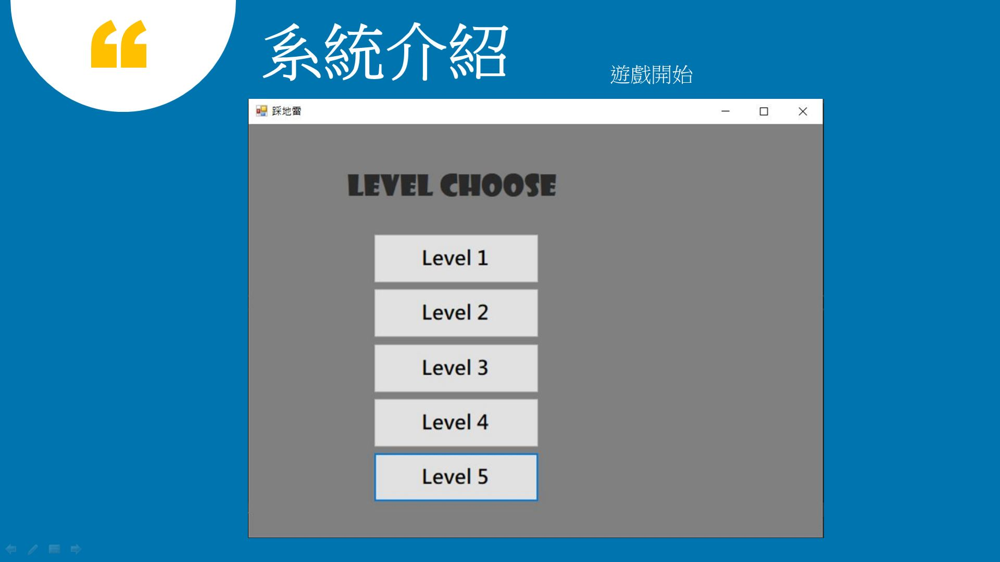
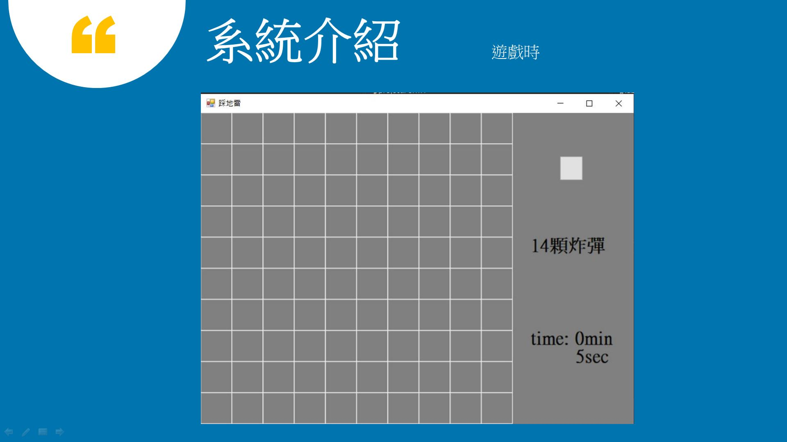
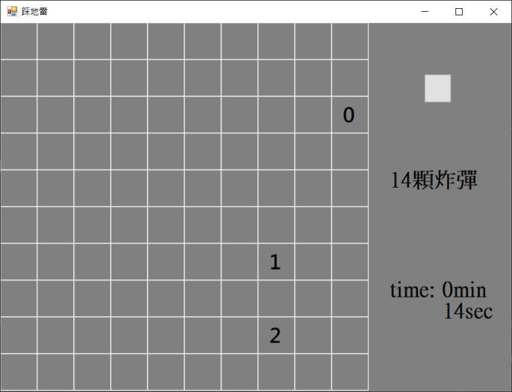
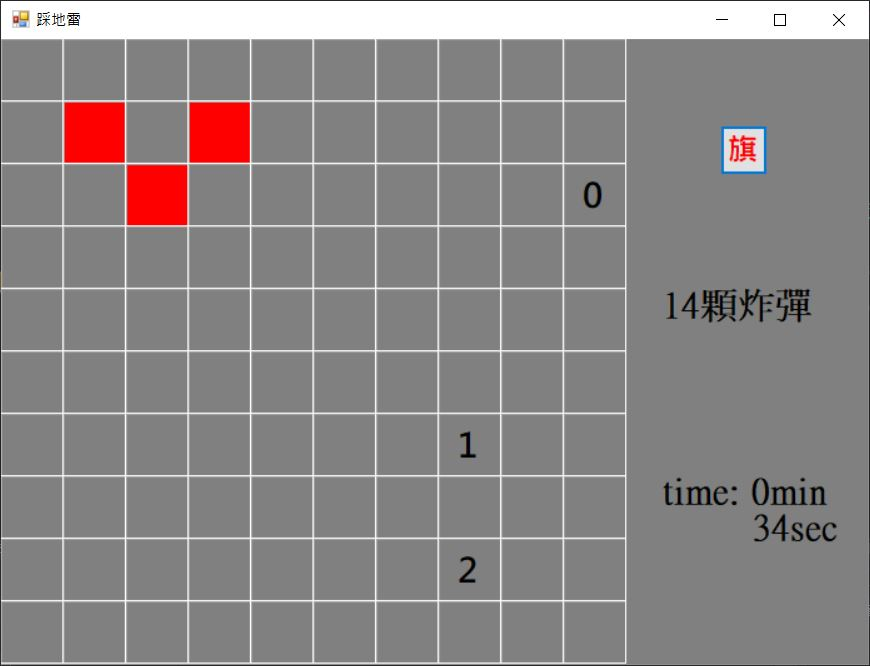
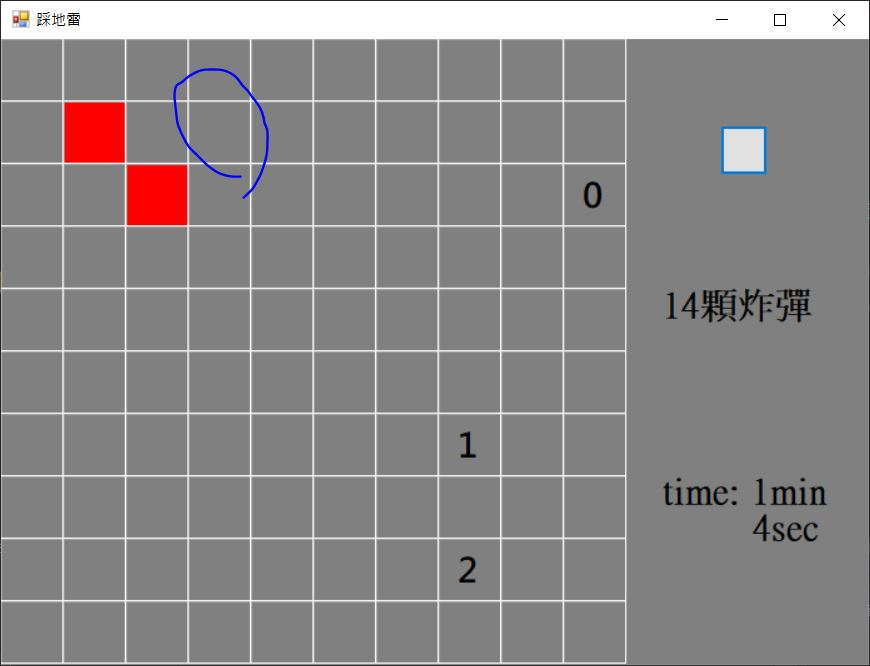
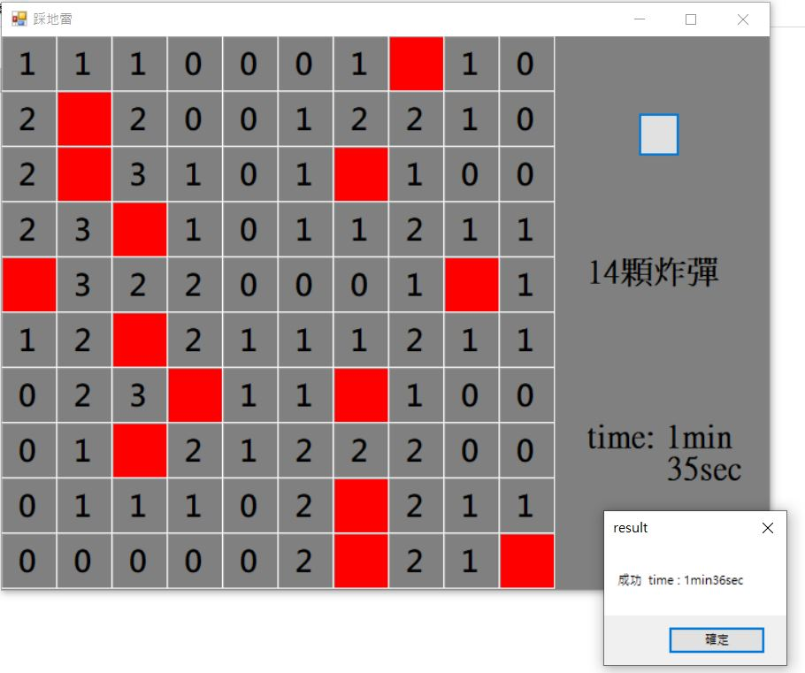
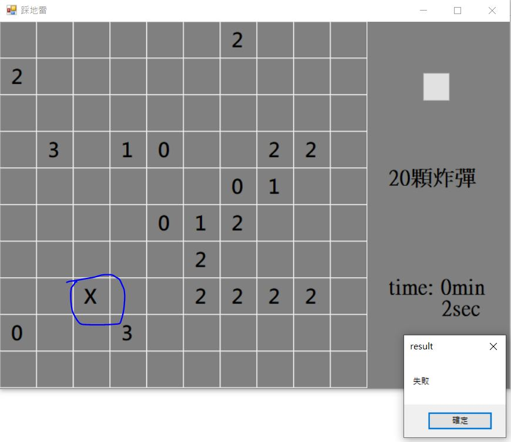

# Minesweeper_game
### 視窗程式設計 小組期末專題
日期 : 2020/01/02

組員 : 1072919 廖亭柔、1072928 江毓晴

完成功能 : 
* 遊戲過程中會隨機出現多個數字作為提示
* 與正版相異出現數字的位置並非完全位於選取格的附近
* 提供插旗設置方便標記炸彈可能位置
* 提供炸彈數目
* 附有計時系統

遊戲玩法 :
1. 選取關卡難度

2. 進入遊戲

3. 可設立旗幟

4. 找到所有地雷，成功；否則，失敗

